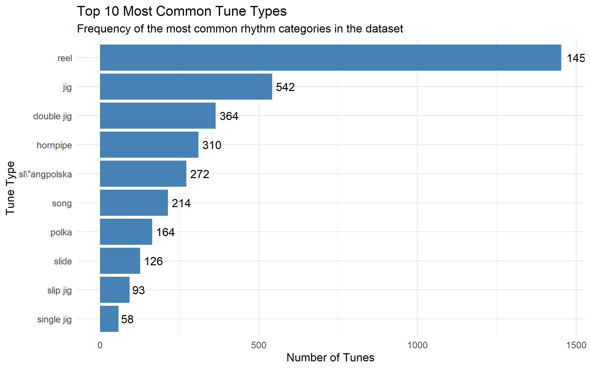
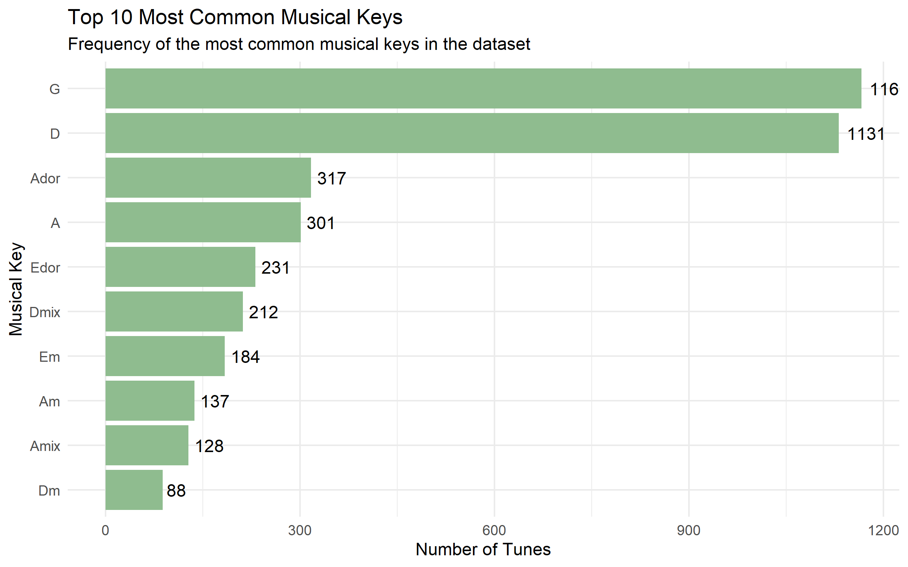
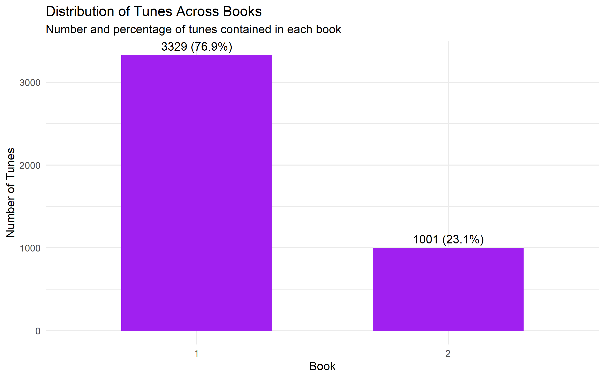
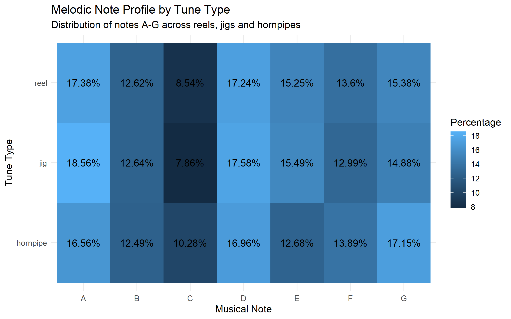
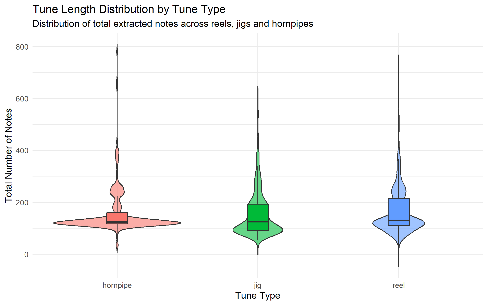
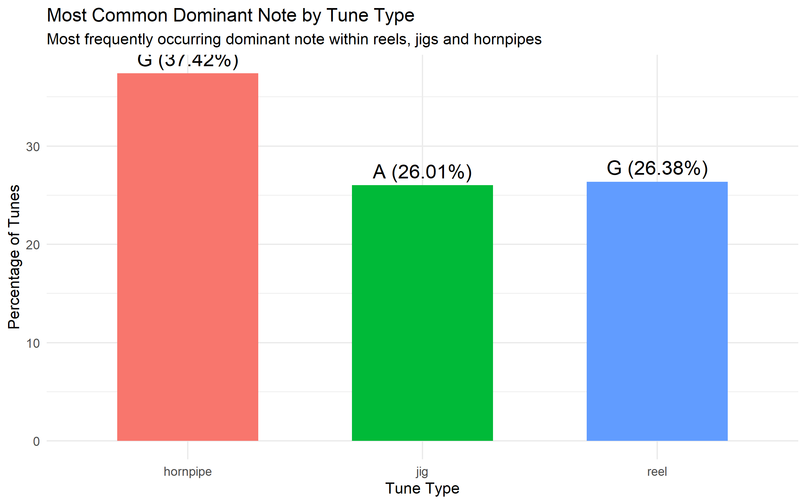

# Traditional Music Data Analysis: From ABC Notation to Insights

**Name:** Hania Amear  
 


## Description of the Project

This project explores a collection of traditional music stored in ABC notation
using Python, SQLite and R.

Python is used to process the original ABC files, extract tune information and
store the data in an SQLite database. The application also allows users to
search and explore tunes by title, type and book.

The project was then extended into a data analysis workflow using R. The data
is cleaned and explored to identify patterns in tune types, musical keys and
the distribution of tunes across the collection.

Musical notes are also extracted directly from the ABC notation to create new
features, including tune length and dominant note. These features are used to
compare reels, jigs and hornpipes and visualise patterns in their musical
characteristics.

The project combines data processing, database management, feature engineering,
data analysis and visualisation in one workflow:

**ABC Notation → Python → SQLite → R → Analysis → Visualisation**

## Technologies Used

- Python
- Pandas
- SQLite
- R
- DBI
- RSQLite
- dplyr
- tidyr
- stringr
- ggplot2
- Git
- GitHub

## Instructions for Use

### 1. Prepare the ABC Files

Place the ABC notation files inside the `abc_books` directory.

The program expects the ABC files to be organised into the appropriate book
folders.

### 2. Install the Required Python Libraries

Make sure Python and the required libraries are installed.

### 3. Run the Python Application

Run:

```bash
python main.py
```

The Python application processes the ABC notation files and stores the
extracted information in the SQLite database.

The interactive menu can then be used to search and analyse the tune
collection.

### 4. Run the R Analysis

After the database has been created, the R analysis can be run from:

```text
dashboard/app.R
```

The following R packages are required:

```r
library(DBI)
library(RSQLite)
library(dplyr)
library(ggplot2)
library(stringr)
library(tidyr)
```

The R analysis reads the tune data from the SQLite database and performs the
data cleaning, feature engineering, analysis and visualisation.

## How the Python Application Works

### Database Connection

SQLite is used to store the tune information.

The `init_db()` function establishes a connection to the `tunes.db` database
and creates a table containing information including:

- Book number
- File path
- Tune number
- Title
- Rhythm
- Meter
- Key
- Complete raw ABC notation

Database connections are opened by the functions that require access to the
stored tune data.

### File Processing

The `build_database_from_files()` function scans the `abc_books` directory for
numbered folders, where each folder represents a book collection.

For each ABC file found, the `parse_abc_file()` function reads the file and
identifies individual tunes using their `X:` headers.

Metadata including the title, rhythm, meter and musical key is extracted from
the ABC notation and stored in SQLite.

### Python Data Analysis

The `load_tunes_dataframe()` function loads the tune information from SQLite
into a Pandas DataFrame.

This allows the data to be used for:

- Filtering
- Case-insensitive searches
- Searching by title
- Searching by tune type
- Summary statistics

## R Data Analysis

I extended the original Python project by using R to investigate the musical
dataset in greater depth.

The R analysis connects directly to the SQLite database produced by the Python
application.

### Data Cleaning

The rhythm and key variables are cleaned before analysis.

Rhythm names are converted to lowercase and unnecessary spaces are removed so
that values such as `Reel` and `reel` are treated as the same category.

### Exploratory Data Analysis

The first stage explores the overall structure of the dataset.

The analysis includes:

- Top 10 most common tune types
- Top 10 most common musical keys
- Distribution of tunes across books

### Musical Note Extraction

The `raw_text` column contains the original ABC notation.

The R analysis separates the musical content from the ABC metadata and extracts
the musical note letters A-G.

For this analysis, uppercase and lowercase note letters are converted to the
same note. This means octave differences are not considered.

### Feature Engineering

After extracting the musical notes, I created additional features for each tune:

- Total number of extracted notes
- Number of unique note letters
- Dominant note
- Number of occurrences of the dominant note
- Percentage of the tune represented by its dominant note

These features allowed the original ABC notation to be used for further
quantitative analysis.

## Focused Analysis

After exploring the complete dataset, reels, jigs and hornpipes were selected
for more detailed analysis.

The focused analysis investigates:

- Distribution of notes A-G
- Tune length
- Dominant notes
- Differences in note usage

## Visualisations and Findings

### 1. Top 10 Most Common Tune Types


Reels are the most common tune type in the dataset with 1,453 tunes, followed
by jigs with 542 tunes and double jigs with 364 tunes. Hornpipes are also a
major category with 310 tunes.
Based on their frequency and suitability for comparison, reels, jigs and
hornpipes were selected for the focused analysis.

### 2. Top 10 Most Common Musical Keys



G and D are clearly the most common musical keys, with 1,166 tunes in G and
1,131 in D. Together they account for more than half of the 4,330 tunes in
the dataset.
This shows that the collection is strongly concentrated around these two
musical keys.
### 3. Distribution of Tunes Across Books



The dataset contains 4,330 tunes across two books. Book 1 contains 3,329
tunes (76.9%), while Book 2 contains 1,001 tunes (23.1%).

This shows that most of the dataset comes from Book 1.

### 4. Melodic Note Profile by Tune Type



The overall distribution of notes A-G is relatively similar across the three
tune types, but some differences can be observed.

Jigs have the highest proportion of A notes at 18.56%, while hornpipes have
the highest proportion of G notes at 17.15%. The use of B is particularly
similar across all three groups at approximately 12.5%.

This suggests that the three tune types share broadly similar note profiles
while still showing some differences in individual note usage.


### 5. Tune Length Distribution




The typical tune lengths are very similar. The median number of extracted
notes is 125 for hornpipes, 126 for jigs and 130 for reels.

However, the distributions show different levels of variation. Hornpipes are
more tightly concentrated around their typical length, while jigs and reels
have a wider spread and contain a number of much longer tunes.

This shows that the main difference is not the typical tune length, but the
variation in length within each tune type.


### 6. Most Common Dominant Note



G is the most common dominant note for both hornpipes and reels, while A is
the most common dominant note for jigs.

G is the dominant note in 37.42% of hornpipes and 26.38% of reels, while A
is the dominant note in 26.01% of jigs.

The strongest concentration can be seen in hornpipes, where more than a third
have G as their most frequently occurring note


## Key Findings

The analysis shows that reels are the most common tune type in the dataset and
that G and D are the most frequently occurring musical keys.

The deeper comparison of reels, jigs and hornpipes found that their overall
note distributions and typical tune lengths are relatively similar. However,
differences appear in the variability of tune length and in which note is most
frequently dominant.

These findings demonstrate how information extracted directly from ABC
notation can be transformed into numerical features and used to compare
musical patterns between different tune types.

## Project Structure

```text
dcp25-assignment/
│
├── main.py
├── README.md
├── .gitignore
│
├── abc_books/
│
├── dashboard/
│   └── app.R
│
├── plots/
│   ├── EX_top_tune_types.png
│   ├── EX_top_common_keys.png
│   ├── EX_distribution_tunes_books.png
│   ├── EXP_melody_note.png
│   ├── EXP_tune_length.png
│   └── EXP_dominant_note.png
│   
│
└── images/
```

## Analysis Limitations

The musical note analysis uses simplified note-letter extraction from ABC
notation.

Octave and accidental differences are not considered in the current analysis.
The findings should therefore be interpreted as descriptive patterns of note
usage rather than a complete melodic or harmonic analysis.

The analysis also identifies descriptive differences between tune types but
does not test whether these differences are statistically significant.

## What I Am Most Proud Of

I am most proud of developing the original assignment into a project that uses
multiple technologies as part of one complete data workflow.

I integrated Python file parsing, SQLite database storage and Pandas data
handling, and then extended the project by connecting the same data to R for
further analysis.

I am particularly proud of using the raw ABC notation to extract musical note
information and create new features such as tune length and dominant note. This
allowed me to move beyond analysing only the existing database columns and
derive new information from the original musical data.

I also used R and ggplot2 to turn the analysis into clear visualisations. This
helped me understand how data analysis involves not only processing data, but
also identifying patterns and communicating findings visually.

Another part I am proud of was identifying through testing that duplicate data
was being created when rebuilding the database and implementing the
`clear_tunes_table()` function to solve the problem. This showed me the
importance of testing, debugging and considering edge cases when developing a
data application.

## What I Learned

This project helped me develop skills across both programming and data
analysis.

Through the Python part of the project, I learned how to:

- Parse semi-structured ABC notation files
- Extract and organise metadata
- Store and query data using SQLite
- Work with Pandas DataFrames
- Build functions for searching, filtering and analysing data
- Debug problems and handle duplicate data

Extending the project with R taught me how to:

- Connect R to an SQLite database
- Clean and transform data using dplyr
- Work with list-based and text data
- Extract information from raw notation using string processing
- Engineer new features from existing data
- Perform exploratory and explanatory data analysis
- Compare groups using percentages and summary statistics
- Create and customise visualisations using ggplot2
- Interpret graphs instead of only producing them

I also gained experience using Git and GitHub to manage different stages of a
project and keep track of changes.

Overall, the project helped me understand how Python, databases and R can be
combined as part of one data-analysis workflow, from raw data processing
through to analysis, visualisation and interpretation.

## References

**Bryan Duggan – Lecture Notes**

Python Tabulate:  
https://www.datacamp.com/tutorial/python-tabulate

Accessing SQLite Databases Using Python and Pandas:  
https://datacarpentry.github.io/python-ecology-lesson/instructor/09-working-with-sql.html

Python SQLite:  
https://www.geeksforgeeks.org/python/python-sqlite/

Python Type Hints:  
https://www.geeksforgeeks.org/python/type-hints-in-python/)


